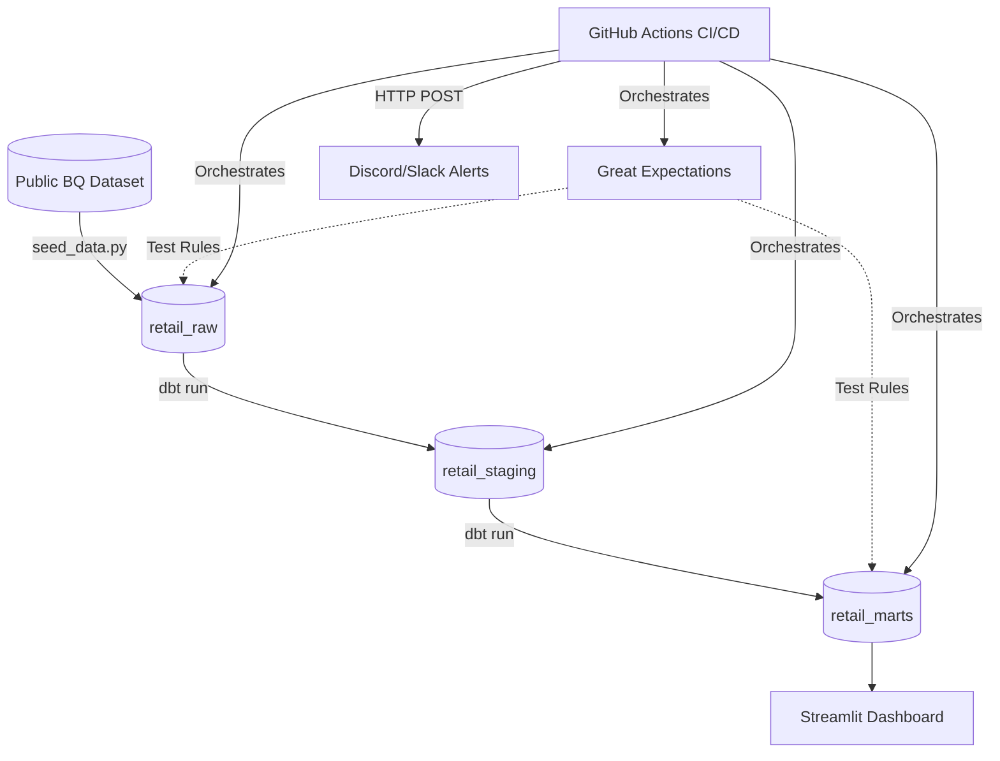

# 🧑‍💻 Cloud Data Warehouse Testing & CI/CD Framework

> **University Midterm Project**  
> An automated, production-grade Data Warehouse pipeline built on **Google BigQuery** (Free Tier) leveraging the Modern Data Stack: **dbt-core**, **Great Expectations**, and **GitHub Actions**. Features an interactive Streamlit UI and Real-time Discord Alerting. 

---

## 🎯 Project Overview

This project demonstrates a fully automated Data Engineering workflow. It extracts E-commerce data from a public dataset, standardizes it in BigQuery, transforms it into an analytical Star Schema using dbt, and runs rigorous data quality tests using Great Expectations.

The entire process is orchestrated completely hands-free via GitHub Actions CI/CD pipelines, embodying the principle of **"Fail-Fast Data Quality"**.

---

## 🏗️ Architecture & Data Flow



Our BigQuery layers strictly follow the medallion/Kimball architecture:
1. **Raw (`retail_raw`)**: Exact landing zone (Strings/Timestamps).
2. **Staging (`retail_staging`)**: Cleansed, deduplicated, and typed views.
3. **Marts (`retail_marts`)**: Business-ready Star Schema (`fact_sales`, `dim_customer`, `dim_product`).

---

## 🧰 The Tech Stack

| Component | Tool | Purpose | Cost |
| :--- | :--- | :--- | :--- |
| **Cloud DW** | `Google BigQuery` | Scalable Serverless Data Storage | Free |
| **Transformations** | `dbt-core` | SQL Modularity & Lineage | Free |
| **Data Quality** | `Great Expectations`| Statistical Profiling & Anomalies | Free |
| **Orchestration** | `GitHub Actions` | CI/CD Automated Pipelines | Free |
| **Visualization** | `Streamlit` | Interactive Executive Dashboard | Free |
| **Alerting** | `Discord Webhooks` | Real-time Slack/Discord Pings | Free |

---

## 🌟 Key Features Built for Defense

### 1. The "Fail-Fast" CI/CD Pipeline
- **CI (Pull Requests):** Opens a temporary environment, compiles dbt, and runs data tests. Code cannot be merged if it degrades BigQuery performance or breaks schemas.
- **CD (Main Branch):** Automatically refreshes raw data, builds physical Mart tables, runs Great Expectations checks, and sends out alerts.

### 2. Interactive "Chaos Mode" Failure Demo
Want to prove the pipeline actually catches bad data?
1. Go to GitHub **Actions** -> **CD Pipeline**.
2. Click **Run workflow**.
3. Under **Simulate a Pipeline Failure**, choose a failure scenario (e.g., `orphan` or `status`).
4. Watch the pipeline intentionally insert bad records, fail the designated test phase, and fire a rich alert to Discord!

### 3. Real-time Status Alerting
Integrated custom Python scripts (`alert_webhook.py`) into the CI/CD YAML files. The pipeline proactively pushes rich-embed notifications to Discord/Slack groups summarizing whether the data refresh was a `SUCCESS` ✅ or `FAILED` 🚨.

### 4. Interactive Data Dashboard
A live dashboard built with `Streamlit` that queries BigQuery directly. It visualizes Top Grossing Categories, Customer Demographics, and Order Status Breakdowns using `Plotly`. Can be hosted natively on Streamlit Community Cloud.

---

## 🚀 Local Setup & Quick Start

### 1. Prerequisites
- Python 3.10+
- A Google Cloud Project with BigQuery API enabled.
- A GCP Service Account Key (JSON) with **BigQuery Data Editor** + **BigQuery Job User**.

### 2. Installation
```bash
git clone https://github.com/Quocanh1508/dwh-midterm.git
cd dwh-midterm

# Create virtual environment
python -m venv .venv
# Windows: .venv\Scripts\activate   |   Mac/Linux: source .venv/bin/activate

pip install -r requirements.txt
```

### 3. Configure Credentials (.env)
Copy the template and paste your GCP details:
```bash
cp .env.example .env
```
Ensure `GOOGLE_APPLICATION_CREDENTIALS` points to your downloaded JSON key file.

### 4. Bootstrap the Data Warehouse
```bash
python scripts/setup_bq.py      # Creates datasets (raw, staging, marts)
python scripts/seed_data.py     # Pulls sample e-commerce data to Raw layer
```

### 5. Run dbt & Great Expectations locally
```bash
# Build models
cd dbt
dbt deps
dbt run --profiles-dir .
dbt test --profiles-dir .

# Run data quality suites
cd ..
python scripts/generate_expectations.py
python scripts/run_ge.py raw_checkpoint
```

### 6. Run the Dashboard
```bash
streamlit run app.py
```

---

## 🔄 GitHub Secrets Configuration
To make the automated Cloud CI/CD pipelines work, add the following to your GitHub Repo -> **Settings** -> **Secrets and variables** -> **Actions**:

| Secret Name | Description |
| :--- | :--- |
| `GCP_PROJECT_ID` | Your Google Cloud Project ID (e.g. `dwh-midterm-123456`) |
| `GCP_SA_KEY` | The **entire raw JSON string** of your service account key. |
| `DISCORD_WEBHOOK_URL`| The Webhook URL from your Discord Server channel settings. |

---

## 📚 Acknowledgments
Built for University Midterm Assessment covering Cloud Architecture, Quality Assurance, and DevOps Data Engineering principles.
